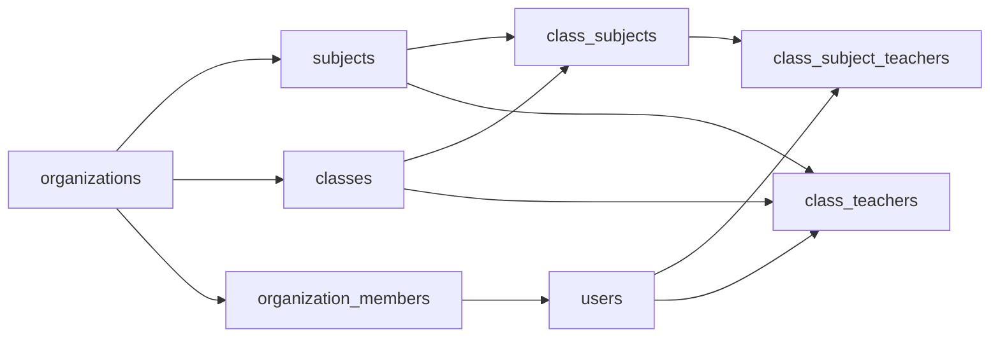

# Organization Assignment System Audit

**Scope:** Read-only inspection of the current implementation on this branch. No schema, API, or UI changes were made as part of this audit.

**Primary UI:** `/organization/assignments`

**Date of inspection:** 2026-08-19

---

## 1. Executive Summary

The organization assignment system is a **two-join-table model**, not a single “Assignment” entity.

1. **Class ↔ Organization Subject** is stored in `class_subjects` (`ClassSubjectEntity`). Unique on `(class_id, subject_id)`.
2. **Teacher ↔ Class ↔ Organization Subject** is stored in `class_subject_teachers` (`ClassSubjectTeacherEntity`). Unique on `(class_subject_id, teacher_id)`. That row is the actual teacher assignment the Assignments page displays.

There is **no** dedicated assignments list/update API. The page:

- Loads org classes (`GET /classes`), org subjects (`GET /organizations/:id/subjects`), and assignable teachers (`GET /organizations/:id/assignable-teachers`).
- Attaches a subject with `POST /classes/:id/subjects`.
- Assigns a teacher with `POST /classes/:id/subjects/:classSubjectId/teachers`.
- Removes a teacher with `DELETE /classes/:id/subjects/:classSubjectId/teachers/:assignmentId`.
- Implements **Edit as unassign + assign** (two HTTP calls, not transactional). There is **no PATCH/PUT assignment endpoint**.

A **legacy parallel table** `class_teachers` is still written when assigning a class-subject teacher (`mirror_class_teacher` defaults to `true`) but is **not** cleaned up on unassign. Exam *creation eligibility* (`canCreateExam`) still consults `class_teachers` / class owner, while *subject-specific test creation* consults `class_subject_teachers`.

A third, unused-by-this-page catalog exists: `organization_teacher_subjects` (teacher ↔ org subject, **no class**).

Organization subjects live in the shared `subjects` table with `organization_id` set. Uniqueness in the applied migration is `(organization_id, LOWER(name), LOWER(code))` for org rows.

---

## 2. Current Architecture

```text
Organization
  ├── organization_members (OWNER | ADMIN | ASSISTANT | TEACHER | STUDENT)
  ├── subjects (organization_id = this org)     ← “Organization Subjects”
  ├── classes (organization_id = this org)
  │     ├── class_students
  │     ├── class_teachers          ← legacy Class + Teacher (+ optional subject)
  │     └── class_subjects          ← Class ↔ Organization Subject
  │           └── class_subject_teachers  ← Teacher ↔ that ClassSubject
  └── organization_teacher_subjects ← Teacher ↔ Org Subject (no class; not used by Assignments UI)
```



**Does the implementation represent `Class ↔ Organization Subject`?**  
Yes, via `class_subjects`.

**Does it represent `Teacher ↔ Class ↔ Organization Subject`?**  
Yes, via `class_subject_teachers` pointing at a `class_subjects` row (which already binds class + subject). The teacher is not stored as a triple on one table; class is implied through `class_subject_id`.

---

## 3. Database / Entity Model

All listed entities extend `CustomBaseEntity` (`backend/src/common/common-entities/custom-base.enity.ts`):

| Column | Type |
| ------ | ---- |
| `id` | UUID PK (`PrimaryGeneratedColumn('uuid')`) |
| `is_active` | enum `ActiveStatusEnum`, default ACTIVE |
| `created_by` | uuid, nullable |
| `created_user_name` | varchar(100), nullable |
| `updated_by` | uuid, nullable |
| `updated_user_name` | varchar(100), nullable |
| `created_at` / `updated_at` | timestamps, nullable |

### 3.1 `organizations` — `OrganizationEntity`

- **File:** `backend/src/organizations/entities/organization.entity.ts`
- **Table:** `organizations`
- **PK:** `id`
- **Important columns:** `name`, `public_id` (unique index), `organization_number` (unique, nullable), `status` (`OrganizationStatusEnum`), `rejected_reason`, `reviewed_by` (FK user, `onDelete: SET NULL`), `reviewed_at`
- **Relationships:** members, classes, subjects reference this table; no inverse `@OneToMany` declared on the org entity itself
- **Delete:** members/subjects/teacher-subject catalog cascade from org; **classes use `onDelete: SET NULL`** on `organization_id`

### 3.2 `organization_members` — `OrganizationMemberEntity`

- **File:** `backend/src/organizations/entities/organization-member.entity.ts`
- **Table:** `organization_members`
- **PK:** `id`
- **FKs:** `organization_id` → organizations (`CASCADE`), `user_id` → users (`CASCADE`)
- **Unique:** `(organization_id, user_id)`
- **Role column:** `OrganizationMemberRoleEnum`: `OWNER`, `ADMIN`, `ASSISTANT`, `TEACHER`, `STUDENT`
- **Soft remove:** `removed_at`, `removed_by`; `removeMember` also sets `is_active = INACTIVE`
- **Cardinality:** many members per org; one membership row per (org, user)

This is the org-level Teacher/Student/Owner relationship. It is **not** a class assignment.

### 3.3 `subjects` — `SubjectEntity`

- **File:** `backend/src/subjects/entities/subject.entity.ts`
- **Table:** `subjects`
- **PK:** `id`
- **FKs:** `organization_id` → organizations (`CASCADE`, nullable)
- **Important columns:** `name` varchar(150), `code` varchar(50) nullable
- **Indexes (entity):**
  - Unique `UQ_subjects_global_name` on `name` **where `organization_id IS NULL`**
  - Unique `UQ_subjects_org_name_code` on `(organization_id, name, code)` **where `organization_id IS NOT NULL`**
- **Indexes (migration `1754700000000-UniqueOrgSubjectNameCode.ts`):** unique on `(organization_id, LOWER(name), LOWER(code))` where org is not null
- **Cardinality:** many org subjects per org; `NULL` organization_id = global/platform catalog

There is **no** separate `organization_subjects` table. “Organization Subject” means a `subjects` row with `organization_id` set.

### 3.4 `classes` — `ClassEntity`

- **File:** `backend/src/classes/entities/class.entity.ts`
- **Table:** `classes`
- **PK:** `id`
- **FKs:** `teacher_id` → users (`CASCADE`) — primary creator/owner; `organization_id` → organizations (`SET NULL`, nullable)
- **Important columns:** `class_name`, `description`, `public_id` (unique), `class_kind` (`PERSONAL` | `ORGANIZATION`)
- **Children:** `classStudents`, `classTeachers`, `classSubjects` (`cascade: true` on OneToMany)

Org classes are those with `organization_id` set (creation path forces `ORGANIZATION` kind when org context is present).

### 3.5 `class_students` — `ClassStudentEntity`

- **File:** `backend/src/classes/entities/class-student.entity.ts`
- **Table:** `class_students`
- **Unique:** `(class_id, student_id)`, `(class_id, invitation_token)`
- **FKs:** `class_id` → classes (`CASCADE`); `student_id` → users (`CASCADE`, nullable)
- **Status:** `INVITED` | `PENDING` | `JOINED`
- **Cardinality:** many students per class; a student may join many classes

Students are **not** part of the Assignments page workflow. Joining an org class upserts `organization_members` as `STUDENT` (`upsertStudentMember`).

### 3.6 `class_subjects` — `ClassSubjectEntity` (Class ↔ Subject)

- **File:** `backend/src/classes/entities/class-subject.entity.ts`
- **Table:** `class_subjects`
- **Unique:** `(class_id, subject_id)` — a class cannot attach the same subject twice
- **FKs:** `class_id` → classes (`CASCADE`); `subject_id` → subjects (`CASCADE`)
- **Children:** `teachers` → `ClassSubjectTeacherEntity` (`cascade: true`)
- **Cardinality:** many-to-many Class ↔ Subject through this join table

This **is** the Class + Organization Subject relationship.

### 3.7 `class_subject_teachers` — `ClassSubjectTeacherEntity` (the assignment)

- **File:** `backend/src/classes/entities/class-subject-teacher.entity.ts`
- **Table:** `class_subject_teachers`
- **Unique:** `(class_subject_id, teacher_id)` — same teacher cannot be assigned twice to the same class-subject; **different teachers can**
- **FKs:** `class_subject_id` → class_subjects (`CASCADE`); `teacher_id` → users (`CASCADE`)
- **Cardinality:** many teachers per class-subject; many class-subjects per teacher

This **is** Teacher + Class + Organization Subject (class implied via `class_subjects.class_id`, subject via `class_subjects.subject_id`).

### 3.8 `class_teachers` — `ClassTeacherEntity` (legacy)

- **File:** `backend/src/classes/entities/class-teacher.entity.ts`
- **Table:** `class_teachers`
- **Unique index:** `(class_id, teacher_id, subject_id)` named `UQ_class_teachers_class_teacher_subject`
- **FKs:** class (`CASCADE`), teacher (`CASCADE`), `subject_id` nullable (`SET NULL`)
- **Used by:** `assignClassTeacher` API; also **mirrored** from `assignClassSubjectTeacher` when `mirror_class_teacher !== false`
- **Not used by:** Assignments page UI

### 3.9 `organization_teacher_subjects` — `OrganizationTeacherSubjectEntity`

- **File:** `backend/src/organizations/entities/organization-teacher-subject.entity.ts`
- **Table:** `organization_teacher_subjects`
- **Unique:** `(organization_id, teacher_id, subject_id)`
- **Meaning:** teacher may teach a subject **in the organization**, with **no class**
- **APIs:** `GET/POST/DELETE /organizations/:id/teachers/:teacherId/subjects`
- **Assignments page:** does **not** read or write this table

### 3.10 Users as teachers/students

- **File:** `backend/src/user/entities/user.entity.ts`
- Platform role (`RolesEnum`) is separate from org `member_role`.
- Class/org assignment endpoints require platform `TEACHER`, `ADMIN`, or `SUPER_ADMIN` via `@Roles` — not org role. Org assistants typically hold platform `TEACHER`.

---

## 4. Organization Subject Model

- Stored as `subjects.organization_id = <org uuid>`.
- Created via `OrganizationsService.createOrganizationSubject` / `findOrCreateOrganizationSubject`.
- Listed via `listOrganizationSubjects` (includes attached class names from `class_subjects`).
- Delete blocked if any `class_subjects` row references the subject.
- Catalog vs class attachment: catalog row can exist with **zero** class attachments.

See **§15 Subject Uniqueness**.

---

## 5. Class Model

- Org class: `organization_id` + `class_kind = ORGANIZATION`.
- Primary `teacher_id` is the creator (owner/assistant who created the class), not necessarily a class-subject teacher.
- Subjects are **not** required at class creation (`ClassService.create` attaches subjects only if `subject_ids` / `new_subjects` are provided). The Assignments UI creates the Class ↔ Subject links later.
- `GET /classes` with org JWT context:
  - **OWNER / ADMIN / ASSISTANT:** all classes in that org
  - **Other members (e.g. TEACHER):** classes they own (`teacher_id`) or appear in `class_teachers`

---

## 6. Teacher Model

“Teacher” in assignment UI means an **active organization member** whose org role is `OWNER`, `ADMIN`, or `TEACHER` (`listAssignableTeachers`).

- Assistants are **academic managers** but are **not** in the assignable-teachers list.
- Students are not listed.
- `assignClassSubjectTeacher` only checks `isMember(...)` — **any active org member UUID**, including `ASSISTANT` or `STUDENT`, can be assigned if called directly against the API.

---

## 7. Class–Subject Relationship

| Concern | Implementation |
| ------- | -------------- |
| Join table | `class_subjects` |
| Attach | `POST /api/v1/classes/:id/subjects` → `ClassService.addClassSubject` → `attachSubjects` |
| Remove | `DELETE /api/v1/classes/:id/subjects/:classSubjectId` → `removeClassSubject` (CASCADE deletes `class_subject_teachers`) |
| Org validation | For org classes, every subject’s `organization_id` must equal the class’s `organization_id` |
| Duplicate attach | Unique `(class_id, subject_id)`; `attachSubjects` returns existing row if already attached |

Same organization subject **can** be attached to many classes (no unique on `subject_id` alone).

---

## 8. Teacher–Class–Subject Assignment

| Concern | Implementation |
| ------- | -------------- |
| Canonical row | `class_subject_teachers` |
| Assign | `POST /api/v1/classes/:classId/subjects/:classSubjectId/teachers` body `{ teacher_id, mirror_class_teacher? }` |
| Remove | `DELETE /api/v1/classes/:classId/subjects/:classSubjectId/teachers/:assignmentId` |
| Update | **Does not exist** |
| Duplicate | `BadRequestException`: “Teacher is already assigned to this class subject” |
| Mirror | By default also inserts `class_teachers` for `(class_id, teacher_id, subject_id)` if missing |
| Unassign mirror | **Not removed** from `class_teachers` |

There is no table named `assignments`. The UI “Current Assignments” is a client-side flatten of `class.classSubjects[].teachers[]`.

---

## 9. Backend APIs

Global prefix: `api`. URI versioning: controllers use `version: '1'` → **`/api/v1/...`**.

Frontend `NEXT_PUBLIC_BASE_URL` is `.../api/v1`. Axios adds `Authorization` and, in org session, `X-Organization-Id` (`frontend/lib/axios.ts`).

`OrganizationContextGuard` (`backend/src/organizations/guards/organization-context.guard.ts`):

- If JWT has `organization_id`, that org is bound (header mismatch → 403).
- If JWT has **no** `organization_id`, `orgContext` is **null even if the header is present** (individual session cannot select an org via header alone).

Platform `@Roles(TEACHER, ADMIN, SUPER_ADMIN)` apply to class and most org academic routes. Platform `STUDENT` cannot call them.

### 9.1 Organization subjects (catalog)

| Method | Route | Controller | Service | Body / params | Auth (service) | Notes |
| ------ | ----- | ---------- | ------- | ------------- | -------------- | ----- |
| GET | `/organizations/:id/subjects` | `OrganizationController.listSubjects` | `listOrganizationSubjects` | — | `requireAcademicManager` | Org-scoped `subjectRepo.find({ organization_id })` |
| POST | `/organizations/:id/subjects` | `createSubject` | `createOrganizationSubject` | `CreateOrganizationSubjectDto` `{ name, code }` | academic manager | `failIfExists=true` → 409 if name+code exists |
| PATCH | `/organizations/:id/subjects/:subjectId` | `updateSubject` | `updateOrganizationSubject` | `UpdateOrganizationSubjectDto` | academic manager | 409 on duplicate name+code |
| DELETE | `/organizations/:id/subjects/:subjectId` | `removeSubject` | `removeOrganizationSubject` | — | academic manager | 400 if still attached to any class |

Validation: `name`/`code` required on create (`IsNotEmpty`, max 150/50).

### 9.2 Assignable teachers

| Method | Route | Service | Auth | Filter |
| ------ | ----- | ------- | ---- | ------ |
| GET | `/organizations/:id/assignable-teachers` | `listAssignableTeachers` | `requireAcademicManager` | active members with role OWNER, ADMIN, or TEACHER |

### 9.3 Classes (used by Assignments page)

| Method | Route | Service | Body | Auth (org class) |
| ------ | ----- | ------- | ---- | ---------------- |
| GET | `/classes` | `ClassService.findAll` | — | approved member; managers see all org classes |
| POST | `/classes` | `create` | `CreateClassDto` | `requireAcademicManager` for org create |
| POST | `/classes/:id/subjects` | `addClassSubject` | `AddClassSubjectDto` `{ subject_id? , name?, code? }` | `assertCanManageClassSubjects` → academic manager |
| DELETE | `/classes/:id/subjects/:classSubjectId` | `removeClassSubject` | — | academic manager |
| GET | `/classes/:id/subjects` | `listClassSubjects` | — | `findOne` / `canManageClass` (broader than academic manager) |
| GET | `/classes/:id/subjects/assigned` | `listAssignedSubjectsForTeacher` | — | same as findOne |
| POST | `/classes/:id/subjects/:classSubjectId/teachers` | `assignClassSubjectTeacher` | `AssignClassSubjectTeacherDto` | academic manager |
| DELETE | `/classes/:id/subjects/:classSubjectId/teachers/:assignmentId` | `removeClassSubjectTeacher` | — | academic manager |

**There is no:**

- `GET /assignments`
- `PATCH` teacher assignment
- Server-side assignment filters (class/subject/teacher)

`AddClassSubjectDto` still allows creating/reusing by `name`+`code` without `subject_id`. The Assignments UI only sends `{ subject_id }`.

### 9.4 Legacy / parallel teacher APIs (not used by Assignments UI)

| Method | Route | Purpose |
| ------ | ----- | ------- |
| POST | `/classes/:id/teachers` | `assignClassTeacher` → `class_teachers` |
| DELETE | `/classes/:id/teachers/:classTeacherId` | remove `class_teachers` row |
| GET | `/classes/:id/teachers` | list `class_teachers` |
| GET/POST/DELETE | `/organizations/:id/teachers/:teacherId/subjects` | `organization_teacher_subjects` |

### 9.5 Errors (typical)

- 400: not a member, already assigned, subjects must belong to this org catalog, missing name/code
- 403: not academic manager, org context mismatch, org not approved
- 404: class / class-subject / assignment / subject not found
- 409: duplicate org subject name+code on create/update

### 9.6 Edit endpoint

**None.** UI Edit = `DELETE` assignment then `POST` assign.

---

## 10. Authorization / Permissions

**Two layers:**

1. **Frontend:** `OrganizationWorkspaceGate` `allowedRoles={["OWNER","ADMIN","ASSISTANT"]}` plus sidebar `memberRoles: ["OWNER","ADMIN","ASSISTANT"]`.
2. **Backend org:** `requireAcademicManager` = OWNER, ADMIN, or ASSISTANT (approved org).
3. **Backend platform:** `@Roles(TEACHER, ADMIN, SUPER_ADMIN)` — org Students (platform STUDENT) cannot call these APIs even if they guessed the URL.

`canManageClass` is **wider** than academic manager (class owner or any `class_teachers` row). That affects `GET` class/subjects, not attach/assign (those call `assertCanManageClassSubjects`).

### Permission matrix (current code)

| Operation | Owner | Admin | Assistant | Org Teacher | Org Student |
| --------- | ----- | ----- | --------- | ----------- | ----------- |
| Create Organization Subject | Yes | Yes | Yes | No (`requireAcademicManager`) | No (platform role + manager) |
| List Organization Subjects | Yes | Yes | Yes | No (same) | No |
| View Assignments page | Yes | Yes | Yes | No (UI gate) | No |
| `GET /classes` in org workspace | All org classes | All | All | Own / `class_teachers` only | No (class API roles) |
| Create Class (org) | Yes | Yes | Yes | No | No |
| Attach Subject to Class | Yes | Yes | Yes | No (`assertCanManageClassSubjects`) | No |
| Remove Subject from Class | Yes | Yes | Yes | No | No |
| Assign Teacher to Class+Subject | Yes | Yes | Yes | No | No |
| Remove Teacher Assignment | Yes | Yes | Yes | No | No |
| Edit assignment (UI delete+post) | Yes | Yes | Yes | No | No |
| Appear in teacher dropdown | Yes | Yes | **No** (not in assignable-teachers) | Yes | No |
| Be assigned via API if UUID posted | If `isMember` | If `isMember` | If `isMember` (API allows; UI does not list) | If `isMember` | **If `isMember` (API allows)** |

Admin is an org role distinct from Assistant; both are academic managers.

---

## 11. Frontend Assignment Page

| Piece | Location |
| ----- | -------- |
| Route | `frontend/app/organization/assignments/page.tsx` |
| Page wrapper | `PageLayout` `route="/organization/assignments"` |
| Main UI | `frontend/component/Organization/OrganizationAssignments.tsx` |
| Gate | `OrganizationWorkspaceGate` |
| Dropdowns | `DropDownComponent` (`frontend/Ui/DropDownComponent.tsx`) |
| State | React `useState` / `useMemo` only — **no Redux slice** |
| Errors | `useApiError` + toasts (`useToast`) |

**No child assignment-specific components** besides the gate and shared dropdown.

### Load

On `organizationId` change: `resetFormState()` then `load()`:

1. `GET /classes`
2. `GET /organizations/:organizationId/subjects`
3. `GET /organizations/:organizationId/assignable-teachers`

`loading` is one flag for the whole page (table shows “Loading assignments...”). Failures clear lists via `handleError`. **No optimistic updates.** Success paths **refetch** via `load()`.

### Shared class selection

`selectedClassId` is shared by Step 1 and Step 2. Changing class clears catalog subject, class-subject, teacher, and edit id.

### Step 1 — Subject → Class

- Class options: all loaded `classes`.
- Org subject options: catalog minus `classSubjects[].subject_id` already on the selected class.
- Placeholders: “Select a class first” / “All organization subjects are already assigned to this class”.
- Submit: `POST /classes/:classId/subjects` `{ subject_id }`.
- Then refetch; auto-selects the new `class_subjects.id` into Step 2 (`selectedClassSubjectId`).
- Compact list of attached subjects with **Remove** → `DELETE /classes/:id/subjects/:classSubjectId`.

### Step 2 — Teacher → Class + Subject

- Subject options: **`classSubjects` of the selected class only** (join rows, not the full catalog).
- Teachers: assignable list minus teachers already on that class-subject (current teacher kept while editing).
- Empty: “Assign an organization subject to this class in Step 1 first.”
- Submit: `POST .../subjects/:classSubjectId/teachers` `{ teacher_id }` (no `mirror_class_teacher` sent → backend default **true**).

### Current Assignments

- Built in memory from `classes.flatMap(classSubjects.flatMap(teachers))`.
- **Class+subject with no teachers does not appear.**
- Client filters: `tableClassFilter`, `tableSubjectFilter` (`subject_id`), `tableTeacherFilter` (`teacher_id`).
- Empty: “No assignments yet. Complete Step 1, then assign a teacher in Step 2.”

### Edit

`handleEditAssignment`:

1. Sets class, class-subject, teacher, `editingAssignmentId`.
2. Scrolls to Step 2.
3. Button becomes **Replace Teacher**.

`handleAssignTeacher` if replacing:

- Same teacher: clears edit state, **no API**.
- Different teacher: **DELETE** old assignment, then **POST** new. If POST fails after DELETE, the class-subject has **no teacher** until retry. Not a DB transaction.

### Remove (table)

`DELETE .../teachers/:assignmentId` then `load()`. Does **not** remove the class-subject row.

### Dropdown disable

`DropDownComponent` has **no disabled prop**. “Disabled” Step 2 fields are approximated by empty `list` and placeholder copy.

---

## 12. Data Flow

### Scenario A — Assign Subject (`Class 9` + `Physics`)

```text
UI: selectedClassId = Class 9, selectedCatalogSubjectId = Physics.id
→ POST /api/v1/classes/{class9}/subjects  { subject_id: physicsId }
→ ClassController.addSubject
→ ClassService.addClassSubject
   → findOne (org context + canManageClass)
   → attachSubjects
      → assertCanManageClassSubjects → requireAcademicManager
      → load SubjectEntity; reject if organization_id !== class.organization_id
      → insert class_subjects (or return existing unique pair)
→ { message, payload: ClassSubjectEntity }
→ Frontend load() GET /classes; set selectedClassSubjectId to new join id
```

### Scenario B — Assign Teacher (`Class 9` + `Physics` + `Teacher A`)

```text
UI: selectedClassSubjectId = class_subjects.id for Class 9+Physics
→ POST /api/v1/classes/{class9}/subjects/{classSubjectId}/teachers
   { teacher_id: teacherA }
→ ClassController.assignSubjectTeacher
→ ClassService.assignClassSubjectTeacher
   → academic manager check
   → isMember(org, teacherA)  (any member role)
   → insert class_subject_teachers
   → if no matching class_teachers row, insert class_teachers (mirror)
→ Frontend load(); row appears in Current Assignments
```

### Scenario C — Remove Teacher A from Class 9 + Physics

```text
→ DELETE /api/v1/classes/{class9}/subjects/{classSubjectId}/teachers/{assignmentId}
→ ClassService.removeClassSubjectTeacher
   → delete class_subject_teachers row only
   → class_teachers mirror row remains
   → class_subjects row remains
→ Frontend load(); row gone from table; Physics still attached in Step 1 list
```

### Scenario D — Edit Teacher A → Teacher B (same class+subject)

```text
1. UI prefill Step 2 (no API)
2. DELETE assignment A  (same as Scenario C)
3. POST assign Teacher B (same as Scenario B)
No PATCH. Not transactional.
```

---

## 13. Supported Relationship Scenarios

| Case | Example | Supported? | Why |
| ---- | ------- | ---------- | --- |
| 1. Class has many subjects | Class 9: Physics, Chemistry, … | **Yes** | Multiple `class_subjects` per `class_id` |
| 2. Subject on many classes | Physics → 9, 10, 11 | **Yes** | Unique is `(class_id, subject_id)`, not `subject_id` alone |
| 3. Teacher, many subjects, same class | A → Class 9 Physics + Chemistry | **Yes** | One `class_subject_teachers` per class-subject |
| 4. Teacher, same subject, many classes | A → 9 Physics and 10 Physics | **Yes** | Different `class_subject_id`s |
| 5. Different teachers, different subjects, same class | 9: Physics A, Chemistry B | **Yes** | Independent join rows |
| 6. Multiple teachers, **same** class+subject | Class 9 Physics → A and B | **Yes (supported)** | Unique is `(class_subject_id, teacher_id)`; UI keeps offering remaining teachers |

Case 6 is intentional in both uniqueness constraint and UI (teachers already assigned are filtered out of the dropdown, others remain).

---

## 14. Organization Scoping

**What is scoped correctly (for a normal org JWT session):**

- Classes: `findAll` filters `class.organization_id = orgContext.organizationId`.
- Subjects catalog: `where: { organization_id: organizationId }`.
- Attach: rejects subjects whose `organization_id` ≠ class org.
- Assignable teachers: members of that org id.
- Assign teacher: `isMember` of that org.
- Guard: JWT `organization_id` cannot be overridden by another header.

**Risks / gaps:**

1. **`class_teachers` leftover after unassign** can still satisfy `canManageClass` and `canCreateExam` for that class (class-level), even after the subject-teacher assignment is gone. Subject-level `assertTeacherAssignedToClassSubject` still blocks creating a test for that subject without a `class_subject_teachers` row.
2. **`assignClassSubjectTeacher` does not require TEACHER role** — a student member id can be stored as `teacher_id`.
3. **`listOrganizationSubjects` class names** are any `class_subjects` pointing at those subject ids. Attach path prevents other orgs from attaching these subjects, so this is unlikely to leak **if** attach validation always held. Attachments are not re-filtered by `class.organization_id` in the list mapper.
4. **Platform `ADMIN` / `SUPER_ADMIN`:** `ClassService.findOne` returns the class **without** org-context match for those platform roles. Cross-org access for platform admins is by design in that branch; **Unable to determine from current implementation** whether production super-admins use this in org workspaces.
5. **Individual JWT + `X-Organization-Id`:** guard **ignores** the header (`orgContext = null`). Accidental mixing of personal classes into the Assignments page requires an org session; the page also gates `sessionMode === "organization"`.
6. **Class `organization_id` `onDelete: SET NULL`:** if an organization row were deleted, classes could become unaffiliated while child rows remain until subject CASCADE. Unusual operational path.

Frontend reset on `organizationId` change clears form/filters so another org’s dropdown values do not linger.

---

## 15. Subject Uniqueness

| Rule | Current behavior |
| ---- | ---------------- |
| Org-scoped uniqueness | **Yes:** `(organization_id, name, code)` for org rows |
| Case | Migration unique index uses `LOWER(name), LOWER(code)`. Service duplicate checks use `ILike`. |
| Same name, different code in one org | **Allowed** (e.g. Physics + PHY-901 and Physics + PHY-902) |
| Same name **and** code twice in one org | **Rejected** (409 on create with `failIfExists`; unique index at DB) |
| Same name+code in another org | **Allowed** (org id is part of the unique key) |
| Global subjects (`organization_id IS NULL`) | Unique on `name` only (`UQ_subjects_global_name`) |

Entity decorator unique is on raw `name`/`code` columns; the **applied migration** is the case-insensitive expression index. If a database never ran `1754700000000-UniqueOrgSubjectNameCode.ts`, uniqueness could differ. **Unable to determine from current implementation** whether that migration has been applied in every environment.

---

## 16. Current UI vs Backend Model

| UI suggests | Backend stores |
| ----------- | -------------- |
| “Assignments” as first-class records | Flattened `class_subject_teachers` |
| Step 1 Class → Organization Subject | `class_subjects` — **accurate** |
| Step 2 Class + Org Subject → Teacher | `class_subject_teachers` — **accurate** |
| One teacher per table row | Multiple teachers per class-subject **allowed**; each is a row |
| Edit assignment | No update API; delete + insert |
| Filters on Current Assignments | Client-only |
| Teacher list = org teachers | OWNER/ADMIN/TEACHER members, not ASSISTANT |
| Removing a table assignment undoes teaching rights cleanly | `class_subject_teachers` removed; **`class_teachers` mirror remains** |

**Redundant / parallel models:**

- `class_teachers` vs `class_subject_teachers`
- `organization_teacher_subjects` (no class) vs class-subject teachers

**UI vs API extras:**

- API can attach by `name`+`code` (creates catalog subject). UI does not.
- API can assign any org member. UI only offers OWNER/ADMIN/TEACHER.

**Missing in UI:** class+subject pairs with zero teachers (exist in Step 1 list only).

---

## 17. Current Problems / Risks

### Critical

1. **Unassign does not remove `class_teachers` mirror.** After Remove/Edit, `canCreateExam` / `canManageClass` can still treat the user as a class teacher. Subject-gated test create still needs `class_subject_teachers`, so behavior is **inconsistent** rather than a full privilege leftover on tests, but class management/exam-create-at-class-level can remain open.
2. **Edit is non-transactional DELETE then POST.** A failed second request leaves the class-subject with no teacher (or the old teacher already gone).

### High

3. **Two assignment tables** (`class_teachers` and `class_subject_teachers`) with different consumers. Access checks disagree depending on the code path.
4. **API can assign STUDENT (or ASSISTANT) user ids** as `class_subject_teachers.teacher_id` because only `isMember` is checked.
5. **`organization_teacher_subjects` is a third teaching graph** unused by the Assignments page; staff may think “teacher subjects” there control class assignments (they do not).

### Medium

6. No server-side assignments resource; table completeness depends on `GET /classes` relations (`classSubjects.teachers.teacher`). If relations were omitted, the table would silently empty.
7. Current Assignments hides class-subjects with no teacher — easy to think Step 1 did not persist.
8. Dropdowns cannot be disabled; empty lists + placeholders only.
9. Assignable teachers include OWNER/ADMIN, which may or may not match product intent (code does this).
10. Assistants can fully manage assignments but cannot be selected as teachers in the UI.
11. `ClassService.findOne` special-cases platform ADMIN/SUPER_ADMIN without org match.

### Low

12. `AddClassSubjectDto` Swagger still says “Existing global subject UUID”.
13. Duplicate class dropdowns in Step 1 and 2 bound to the same state (intentional but easy to misread as independent).
14. Entity unique index metadata vs migration `LOWER(...)` index may confuse future schema diffs.
15. `getMembership` does not filter `removed_at` explicitly; it relies on `is_active` (removeMember sets both).

---

## 18. Recommended Conceptual Model

The product concept:

```text
Organization
├── Organization Subjects
├── Classes
├── Teachers
├── Students
├── Class Subjects
└── Teacher Assignments (Teacher + Class + Organization Subject)
```

**The current implementation can support this**, and the Assignments UI maps Steps 1–2 onto the two join tables that match it.

**Where it differs:**

- Teachers/students are `organization_members`, not separate teacher/student tables.
- Organization Subjects are rows in `subjects`, not a dedicated table.
- Teacher Assignments are `class_subject_teachers`, not a table named assignments, and class is implicit.
- Extra graphs (`class_teachers`, `organization_teacher_subjects`) sit beside the conceptual model and affect authorization.
- Students are class members (`class_students`) plus org membership; they are out of the assignment UI.

So: **the core Class Subject + Class-Subject-Teacher model matches the concept; the surrounding legacy/catalog teacher-subject tables and mirror writes do not.**

---

## 19. Open Questions / Decisions Needed

1. Should **exactly one** teacher per class+subject be required? Today **multiple are allowed**.
2. Should **OWNER/ADMIN** remain assignable as teachers?
3. Should **ASSISTANT** be assignable as a teacher?
4. Should unassign **delete the `class_teachers` mirror**, and should `canCreateExam` use **only** `class_subject_teachers`?
5. Should **Edit** become a real PATCH inside a transaction?
6. Should **`organization_teacher_subjects`** be retired, or should class assignment require that catalog link first? Today the Assignments page ignores it.
7. Should Current Assignments show **class-subject rows with no teacher**?
8. Has migration `UniqueOrgSubjectNameCode1754700000000` been applied in all environments?

---

## Appendix: Main files inspected

**Backend**

- `backend/src/classes/entities/class.entity.ts`
- `backend/src/classes/entities/class-subject.entity.ts`
- `backend/src/classes/entities/class-subject-teacher.entity.ts`
- `backend/src/classes/entities/class-teacher.entity.ts`
- `backend/src/classes/entities/class-student.entity.ts`
- `backend/src/classes/class.controller.ts`
- `backend/src/classes/class.service.ts`
- `backend/src/classes/dto/add-class-subject.dto.ts`
- `backend/src/classes/dto/assign-class-subject-teacher.dto.ts`
- `backend/src/subjects/entities/subject.entity.ts`
- `backend/src/organizations/entities/organization.entity.ts`
- `backend/src/organizations/entities/organization-member.entity.ts`
- `backend/src/organizations/entities/organization-teacher-subject.entity.ts`
- `backend/src/organizations/organization.controller.ts`
- `backend/src/organizations/organization.service.ts`
- `backend/src/organizations/organization-access.service.ts`
- `backend/src/organizations/guards/organization-context.guard.ts`
- `backend/src/organizations/enums/organization-member-role.enum.ts`
- `backend/src/exams/exam.service.ts` (org exam create + subject assignment check)
- `backend/src/migrations/1754700000000-UniqueOrgSubjectNameCode.ts`
- `backend/src/common/common-entities/custom-base.enity.ts`
- `backend/src/main.ts`

**Frontend**

- `frontend/app/organization/assignments/page.tsx`
- `frontend/component/Organization/OrganizationAssignments.tsx`
- `frontend/component/Organization/OrganizationWorkspaceGate.tsx`
- `frontend/lib/axios.ts`
- `frontend/utils/sidebarList.tsx`
- `frontend/types/class.d.ts`
