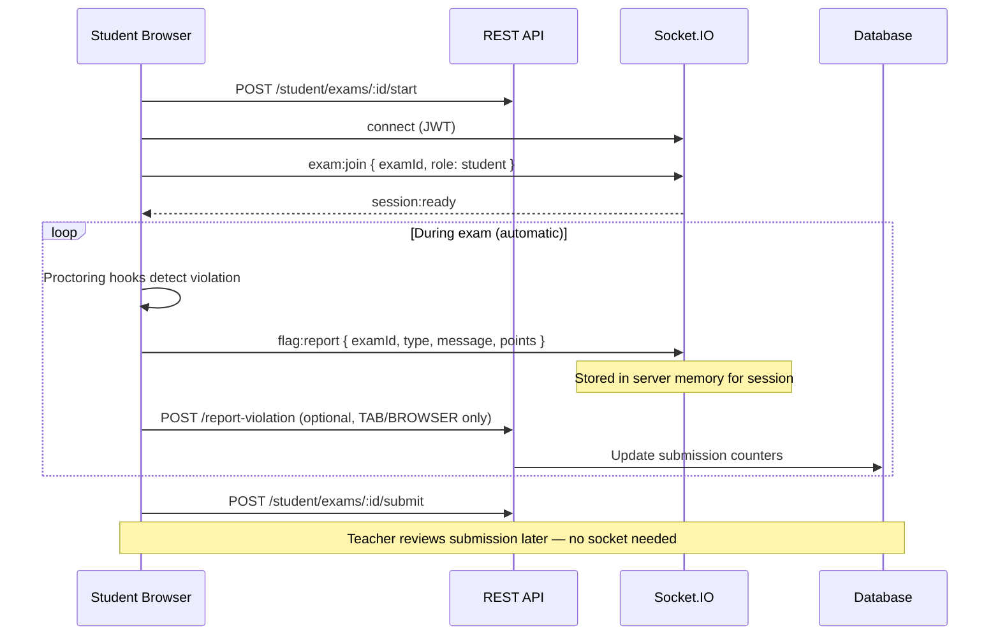

# Tasktaker — Automatic Proctoring & Socket.IO (Frontend Guide)

This document explains how the **student exam proctoring** integration works in Tasktaker. It is written for frontend developers implementing the exam-taking experience.

**Last updated:** March 2026  
**Backend branch:** `main` (proctoring merged)

---

## 1. Summary (read this first)

| Question | Answer |
|----------|--------|
| Who connects to Socket.IO? | **Student only** (while taking an exam) |
| Does the teacher join a socket room? | **No** — there is no live monitoring dashboard |
| What runs automatically? | Client-side proctoring hooks detect violations; the app sends them to the server |
| What is Socket.IO used for? | Real-time delivery of `flag:report` events during the exam |
| What is REST used for? | Loading exam, starting exam, saving answers, submitting, and optional violation counters |
| Reference implementation | `/demo_instructor` repo (same hooks & event names; Tasktaker uses JWT + real exam UUIDs) |

**One sentence:** The student browser runs proctoring detectors automatically and reports violations via Socket.IO. The teacher does nothing during the exam and reviews results later through normal grading/submission APIs.

---

## 2. Architecture



### REST vs Socket — responsibilities

| Concern | Use REST | Use Socket |
|---------|----------|------------|
| Load exam questions | ✅ `GET /v1/exams/:id` | ❌ |
| Start exam session | ✅ `POST /v1/student/exams/:id/start` | ❌ |
| Save / submit answers | ✅ `POST .../answersheet`, `.../submit` | ❌ |
| Join proctoring room | ❌ | ✅ `exam:join` |
| Report rich flags (copy, camera, idle, etc.) | ❌ | ✅ `flag:report` |
| Report tab/browser switch counters (persisted) | ✅ `POST .../report-violation` | Optional |
| Teacher live dashboard | ❌ Not required | ❌ Do not implement |

---

## 3. Environment variables

Add to `frontend/.env`:

```env
# Existing REST base URL
NEXT_PUBLIC_BASE_URL=http://localhost:4000/api/v1

# Socket.IO — backend origin, NO /api path
NEXT_PUBLIC_SOCKET_URL=http://localhost:4000
```

### Port reference

| Setup | Frontend | Backend API + Socket |
|-------|----------|----------------------|
| Local dev (typical) | `http://localhost:3000` | `http://localhost:4000` |
| Docker Compose | `http://localhost:3000` | `http://localhost:4000` (mapped `4000:3000`) |

Backend must allow your frontend origin:

```env
# backend/.env or docker-compose
CLIENT_ORIGIN=http://localhost:3000
```

Multiple origins (comma-separated):  
`CLIENT_ORIGIN=http://localhost:3000,https://staging.tasktaker.com`

---

## 4. Dependencies

```bash
npm install socket.io-client
```

You will also port proctoring **hooks** from `demo_instructor` (browser APIs, ML models, etc.). Those are frontend-only and do not require extra backend packages.

---

## 5. Socket connection

Socket.IO runs on the **same host and port** as the NestJS backend. It is **not** under `/api/v1`.

### 5.1 Connect with JWT

Use the same JWT the app already uses for authenticated REST calls (from login / httpOnly cookie flow — however you currently attach `Authorization` to axios).

```typescript
import { io, type Socket } from 'socket.io-client';

const SOCKET_URL = process.env.NEXT_PUBLIC_SOCKET_URL!;

let socket: Socket | null = null;

export function getProctoringSocket(token: string): Socket {
  if (!socket) {
    socket = io(SOCKET_URL, {
      autoConnect: false,
      transports: ['websocket', 'polling'],
      auth: { token },
    });
  }
  return socket;
}

export function connectProctoring(token: string): Socket {
  const client = getProctoringSocket(token);
  if (!client.connected) {
    client.connect();
  }
  return client;
}

export function disconnectProctoring(): void {
  socket?.disconnect();
}
```

### 5.2 How the backend reads the token

The server accepts JWT from (first match wins):

1. `auth.token` on the Socket.IO handshake (recommended)
2. `token` field on `exam:join` payload
3. `Authorization: Bearer <token>` on the handshake headers

---

## 6. Student exam flow (step by step)

Implement this sequence on the **student exam page**:

### Step 1 — Prerequisites

- Student is logged in (`role: STUDENT`)
- Student has access to the exam (audience rules: class, specific students, or `anyone`)
- Exam has started (`exam_start_time <= now`) before showing questions

Validate access (optional but recommended):

```
GET /api/v1/student/exams/:examId/eligibility
Authorization: Bearer <token>
```

### Step 2 — Start exam (REST)

```
POST /api/v1/student/exams/:examId/start
Authorization: Bearer <token>
Content-Type: application/json

{ "user_agent": "Mozilla/5.0 ..." }
```

Creates an `IN_PROGRESS` submission. Proctoring should only run after this succeeds.

### Step 3 — Load exam content (REST)

```
GET /api/v1/exams/:examId
Authorization: Bearer <token>
```

Returns wizard-shaped payload with `subjects[].questions[]` (no correct answers for students). Questions appear only after `exam_start_time`.

Read proctoring settings from the response:

```json
{
  "formState": {
    "allowScreenShare": false,
    "screenShareDisqualifySeconds": 15,
    "allowNegativeMarking": false,
    "duration": 40
  }
}
```

### Step 4 — Connect socket & join room

```typescript
const token = await getAccessToken(); // your existing auth helper
const examId = '...'; // full UUID

const socket = connectProctoring(token);

socket.emit('exam:join', {
  examId,
  role: 'student',
  // token optional if auth.token is set on connect
});

socket.on('session:ready', (session) => {
  console.log('Proctoring session active', session);
  startProctoringHooks(); // see Section 8
});

socket.on('exam:error', ({ message }) => {
  console.error('Proctoring join failed:', message);
  // e.g. "Authentication required.", "You are not enrolled in this class for this exam"
});
```

### Step 5 — Run proctoring hooks (automatic)

Port from `demo_instructor`:

- `frontend/src/hooks/useProctoring.ts` (orchestrator)
- Individual hooks: `useBrowserMonitoring`, `useKeyboardMonitoring`, `useCameraMonitoring`, etc.
- `frontend/src/services/flagManager.ts` (points, cooldowns, risk levels)

When a hook fires, call:

```typescript
socket.emit('flag:report', {
  examId,
  type: 'TAB_SWITCH',       // string label
  message: 'Student switched browser tab',
  points: 1,                 // number
});
```

### Step 6 — Optional REST violation counter

For **persisted** tab/browser counts on the submission record:

```
POST /api/v1/student/exams/:examId/report-violation
Authorization: Bearer <token>

{
  "violation_type": "TAB_SWITCH",
  "details": "optional text"
}
```

Supported `violation_type` values that **increment DB counters** today:

- `TAB_SWITCH` → `tab_switch_count`
- `BROWSER_SWITCH` → `browser_switch_count`

Other types can be sent in the DTO but only these two update counters currently.

### Step 7 — Submit exam (REST)

```
POST /api/v1/student/exams/:examId/submit
# or
POST /api/v1/student/exams/:examId/answersheet
```

### Step 8 — Cleanup

```typescript
disconnectProctoring();
// stop camera streams, fullscreen, intervals, etc.
```

### Optional — notify room on submit (socket)

```typescript
socket.emit('exam:submit', {
  examId,
  studentId: user.id,
  studentName: user.full_name,
  answers: { /* questionId -> answer */ },
  totalFlagPoints: 5,
});
```

This is **optional** for Tasktaker (no teacher is listening live). REST submit is the source of truth.

---

## 7. Socket events reference

### 7.1 Client → Server (student sends)

#### `exam:join`

Join the proctoring room for one exam.

```typescript
{
  examId: string;          // exam UUID
  role: 'student';         // required for examinees
  token?: string;          // optional if handshake auth.token is set
}
```

**Requirements:**

- Valid JWT
- JWT role must be `STUDENT`
- Student must pass exam access rules (same as REST)

**Responses:**

| Event | When |
|-------|------|
| `session:ready` | Join succeeded |
| `exam:error` | Auth failure, exam not found, access denied |

#### `flag:report`

Report a proctoring violation (automatic, from hooks).

```typescript
{
  examId: string;
  type: string;      // e.g. "TAB_SWITCH", "COPY", "NO_FACE"
  message: string;   // human-readable description
  points: number;    // severity points (see flagManager.ts in demo)
}
```

#### `exam:submit` (optional)

```typescript
{
  examId: string;
  studentId: string;
  studentName: string;
  answers: Record<string, string>;
  totalFlagPoints: number;
}
```

---

### 7.2 Server → Client (student receives)

#### `session:ready`

Acknowledges the student joined proctoring.

```typescript
{
  socketId: string;
  studentId: string;       // user UUID from JWT
  studentName: string;
  joinedAt: string;        // ISO timestamp
  totalFlagPoints: number;
  flags: Array<{
    id: string;
    type: string;
    message: string;
    points: number;
    timestamp: string;
  }>;
}
```

#### `exam:error`

```typescript
{ message: string }
```

Common messages:

- `Authentication required.`
- `Invalid or expired token.`
- `Exam not found.`
- `Only students can join as examinees.`
- `You are not enrolled in this class for this exam`
- `You have been excluded from this exam`

---

### 7.3 Events you can IGNORE (teacher / live monitor — not in scope)

Do **not** implement these for Tasktaker v1:

| Event | Reason |
|-------|--------|
| `exam:join` with `role: 'monitor'` | No live teacher dashboard |
| `monitor:state` | Live session list for monitor |
| `session:joined` / `session:left` | Live monitor updates |
| `flag:update` | Live flag broadcast to monitor |
| `exam:submitted` (listener) | Live submit notification |
| `GET /v1/exams/:id/proctoring/sessions` | Live REST snapshot for monitor |

---

## 8. Porting proctoring hooks from demo_instructor

Copy/adapt these files from the demo repo into Tasktaker frontend:

| Demo path | Purpose |
|-----------|---------|
| `src/hooks/useProctoring.ts` | Wires all detectors together |
| `src/hooks/useBrowserMonitoring.ts` | Tab switch, blur, fullscreen exit |
| `src/hooks/useKeyboardMonitoring.ts` | Copy, paste, right-click, shortcuts |
| `src/hooks/useCameraMonitoring.ts` | Face detection (face-api.js) |
| `src/hooks/useHeadEyeMonitoring.ts` | Gaze / looking away |
| `src/hooks/useObjectDetection.ts` | Phone detection (COCO-SSD) |
| `src/hooks/useVoiceDetection.ts` | Microphone activity |
| `src/hooks/useIdleDetection.ts` | No input timeout |
| `src/hooks/useDevToolsDetection.ts` | DevTools open heuristic |
| `src/hooks/useScreenSharingMonitoring.ts` | Screen share / multi-monitor |
| `src/hooks/useExamFullscreen.ts` | Request fullscreen on enter |
| `src/services/flagManager.ts` | Points, cooldowns, risk levels |
| `src/services/screenShareMonitor.ts` | Display media tracking |
| `src/services/displayEnvironment.ts` | Multi-monitor detection |
| `src/services/webcam.ts` | Camera stream helper |

### Tasktaker-specific changes when porting

| Demo | Tasktaker |
|------|-----------|
| `examId` = 8-char string | `examId` = **full UUID** |
| No authentication | **JWT required** on socket |
| `studentName` sent in `exam:join` | Name comes from JWT — **do not send** `studentName` |
| Socket URL port `10000` | Same as API host (e.g. `4000`) |
| `joinExamRoom({ examId, studentName })` | `exam:join({ examId, role: 'student' })` |

### Wiring hooks to socket

In demo, `reportFlag` calls `socket.emit('flag:report', ...)`. Keep the same pattern:

```typescript
function onProctoringFlag(type: string, message: string, points: number) {
  socket.emit('flag:report', { examId, type, message, points });
}
```

Pass `allowScreenShare` and `screenShareDisqualifySeconds` from exam `formState` into `useScreenSharingMonitoring`.

### Suggested flag types (from demo)

| Type | Default points | Description |
|------|----------------|-------------|
| `TAB_SWITCH` | 1 | Document hidden / tab change |
| `WINDOW_BLUR` | 1 | Window lost focus |
| `FULLSCREEN_EXIT` | 1 | Left fullscreen mode |
| `COPY` | 1 | Copy attempted |
| `PASTE` | 2 | Paste attempted |
| `RIGHT_CLICK` | 1 | Context menu |
| `SHORTCUT` | 1 | Blocked keyboard shortcut |
| `NO_FACE` | 1 | No face in webcam |
| `MULTIPLE_FACES` | 3 | More than one face |
| `LOOKING_AWAY` | 1 | Gaze away from screen |
| `PHONE_DETECTED` | 3 | Object detection |
| `VOICE_ACTIVITY` | 2 | Audio detected |
| `IDLE` | 1 | No mouse/keyboard activity |
| `DEVTOOLS` | 2 | DevTools likely open |
| `SCREEN_SHARING` | 10 | Screen share or multi-monitor violation |
| `PAGE_REFRESH` | 2 | Page reload detected |

Use cooldowns from `flagManager.ts` to avoid spamming the server.

---

## 9. Recommended client module structure

```
frontend/
  lib/
    proctoring/
      socket.ts          # connect, disconnect, join, reportFlag
      useProctoring.ts   # ported from demo
      flagManager.ts     # ported from demo
      hooks/             # individual monitoring hooks
  hooks/
    api/
      useStudentExam.ts  # existing REST hooks
```

### Example `socket.ts`

```typescript
import { io, type Socket } from 'socket.io-client';

const URL = process.env.NEXT_PUBLIC_SOCKET_URL!;

let socket: Socket | null = null;

export function connectProctoring(token: string): Socket {
  if (!socket) {
    socket = io(URL, {
      autoConnect: false,
      transports: ['websocket', 'polling'],
      auth: { token },
    });
  }
  if (!socket.connected) socket.connect();
  return socket;
}

export function joinStudentProctoring(examId: string, token: string): Socket {
  const s = connectProctoring(token);
  s.emit('exam:join', { examId, role: 'student' });
  return s;
}

export function reportProctoringFlag(
  examId: string,
  type: string,
  message: string,
  points: number,
): void {
  socket?.emit('flag:report', { examId, type, message, points });
}

export function disconnectProctoring(): void {
  socket?.disconnect();
}
```

---

## 10. Full student lifecycle example

```typescript
async function beginExamSession(examId: string, token: string) {
  // 1. REST — start
  await api.post(`/student/exams/${examId}/start`, {
    user_agent: navigator.userAgent,
  });

  // 2. REST — load exam (questions + proctoring settings)
  const { data } = await api.get(`/exams/${examId}`);
  const { allowScreenShare, screenShareDisqualifySeconds } = data.payload.formState;

  // 3. Socket — join proctoring room
  const socket = joinStudentProctoring(examId, token);

  await new Promise<void>((resolve, reject) => {
    socket.once('session:ready', () => resolve());
    socket.once('exam:error', ({ message }) => reject(new Error(message)));
  });

  // 4. Start hooks (automatic violations → flag:report)
  useProctoring({
    examId,
    allowScreenShare,
    screenShareDisqualifySeconds,
    onFlag: (type, message, points) =>
      reportProctoringFlag(examId, type, message, points),
    onDisqualify: () => autoSubmitExam(examId),
  });

  return { exam: data.payload, socket };
}
```

---

## 11. Error handling checklist

| Symptom | Likely cause | Fix |
|---------|--------------|-----|
| Socket never connects | Wrong `NEXT_PUBLIC_SOCKET_URL` | Must be backend origin, no `/api` |
| CORS error | `CLIENT_ORIGIN` mismatch | Set backend `CLIENT_ORIGIN` to exact frontend URL |
| `Authentication required` | No JWT on socket | Pass `auth: { token }` on `io()` |
| `Invalid or expired token` | JWT expired | Refresh token / re-login before exam |
| `Exam not found` | Wrong exam UUID | Use id from exam list / join link |
| Access denied on join | Student not in audience | Check class membership / exclusion list |
| `flag:report` has no effect | Student didn't `exam:join` first | Join before reporting flags |
| Flags lost after server restart | Flags stored in memory today | Also use REST `report-violation` for tab/browser; full persistence is a backend follow-up |

---

## 12. REST API quick reference (student exam)

Base: `NEXT_PUBLIC_BASE_URL` → e.g. `http://localhost:4000/api/v1`

| Method | Path | Purpose |
|--------|------|---------|
| `GET` | `/student/exams/:examId/eligibility` | Can student take this exam? |
| `GET` | `/exams/:examId` | Exam content (authorized student) |
| `POST` | `/student/exams/:examId/start` | Start submission |
| `POST` | `/student/exams/:examId/answersheet` | Save full answer map |
| `POST` | `/student/exams/:examId/save-answer` | Save single answer |
| `POST` | `/student/exams/:examId/submit` | Final submit |
| `POST` | `/student/exams/:examId/auto-submit` | Timer expiry submit |
| `POST` | `/student/exams/:examId/report-violation` | Persist tab/browser counts |
| `GET` | `/student/exams/:examId/result` | Result after submit |

All require `Authorization: Bearer <token>` except public exam summary on `GET /exams/:id` without token.

---

## 13. What the teacher does (no socket work)

During the exam: **nothing**.

After the exam, the teacher uses existing grading/submission views to review:

- Submission scores
- `tab_switch_count` / `browser_switch_count` on the submission (from REST `report-violation`)
- (Future) full flag history when backend persists socket flags to DB

No monitor page, no `role: 'monitor'`, no live socket subscription.

---

## 14. Local development checklist

```bash
# Terminal 1 — backend
cd backend
pnpm install
pnpm start:dev
# Default APP_PORT from .env (often 4000)

# Terminal 2 — frontend
cd frontend
npm install
npm run dev
# http://localhost:3000
```

Or Docker:

```bash
CLIENT_ORIGIN=http://localhost:3000 docker compose up
```

Verify socket:

1. Log in as a student in the browser.
2. Open devtools → Network → WS filter.
3. Start an exam → you should see a WebSocket connection to `localhost:4000`.
4. Trigger a tab switch → `flag:report` frame should appear.

---

## 15. Known backend limitations (as of March 2026)

1. **Socket flags are in-memory** — they survive for the server process lifetime but are not yet written to PostgreSQL. Plan REST `report-violation` for tab/browser counts that must persist.
2. **Teacher live monitor API exists but is not required** — `GET /v1/exams/:id/proctoring/sessions` is for optional future live dashboard; skip for v1.
3. **Full flag persistence** (all types, review after exam) is a planned backend enhancement.

---

## 16. FAQ

**Q: Why use Socket if we already have `report-violation` REST?**  
A: REST today only persists two counter fields. Socket supports the full set of rich flags from the demo hooks (copy, camera, phone, etc.) with low latency. Use both: socket for detailed flags, REST for persisted tab/browser counts.

**Q: Must the student stay connected for the whole exam?**  
A: Yes, for real-time flag delivery. Reconnect and re-emit `exam:join` if the socket drops.

**Q: Can proctoring run without Socket?**  
A: Partially — only `TAB_SWITCH` / `BROWSER_SWITCH` via REST. Full demo-style proctoring needs Socket for `flag:report`.

**Q: Does the student send their name on join?**  
A: No. The backend reads `studentId` and `studentName` from the JWT.

**Q: Is there a separate Socket URL in production?**  
A: Usually no — same host as the API (e.g. `https://api.tasktaker.com`).

---

## 17. Contact / backend reference

Backend implementation files:

- `backend/src/proctoring/proctoring.gateway.ts` — Socket events
- `backend/src/proctoring/proctoring-store.service.ts` — in-memory sessions/flags
- `backend/src/exams/student-exam.service.ts` — `reportViolation` REST
- `demo_instructor/frontend/` — reference hooks to port

Swagger (when backend is running): `http://localhost:4000/apidoc`
